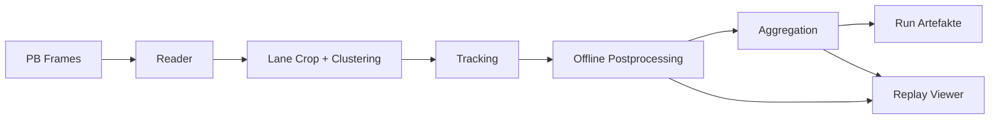
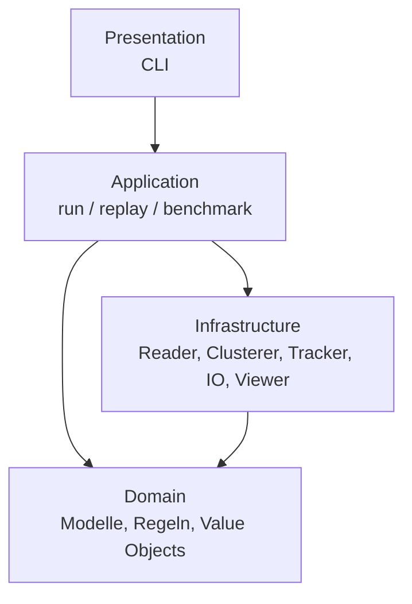
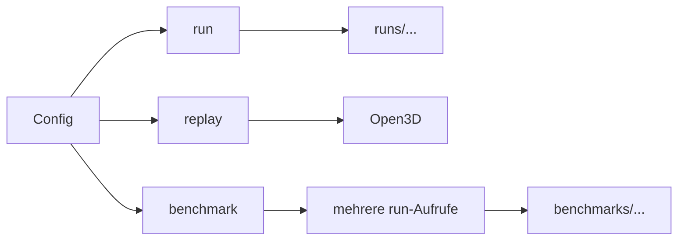

# Tracking Pipeline

Modulare Offline-Pipeline fuer LiDAR-Tracking, Track-Aggregation und Replay auf Basis von `a42.frame.Frame`-Protobufdaten. Das Repo ist darauf ausgelegt, Clusterer, Tracker, Akkumulatoren und Registrierungsbackends austauschbar zu machen, ohne den zentralen Run-Ablauf umzubauen.

## Was das Repo leistet

- liest length-delimited `.pb`-Sequenzen im Format `a42_pb`
- clustert relevante Punkte innerhalb einer Lane-Region
- trackt Objekte ueber mehrere Frames
- aggregiert Punktwolken pro Track zu speicherbaren Fahrzeugwolken
- exportiert Run-Artefakte, Benchmarks und Performance-Reports
- visualisiert denselben Ablauf im Open3D-Replay

Kurz gesagt: `pb -> clustering -> tracking -> aggregation -> artifacts/replay`.

## Quickstart

### Installation

Python `3.10+` wird benoetigt. Empfohlen ist ein frisches virtuelles Environment:

```bash
./scripts/setup.sh
```

Das Skript bevorzugt `python3.12`, faellt lokal aber auf `python3.10` zurueck und installiert das Projekt in `.venv`.

Manuell geht es auch:

```bash
python3.10 -m venv .venv
source .venv/bin/activate
pip install --upgrade pip setuptools wheel
pip install -e .
```

Mit optionalem Registrierungsbackend:

```bash
pip install -e '.[registration]'
```

Mit Dev- und Benchmark-Extras:

```bash
pip install -e '.[dev,registration,benchmark]'
```

Klassifikation ist standardmaessig deaktiviert. Wenn du sie aktivieren willst, brauchst du zusaetzlich ein passendes PointNeXt-Checkout, einen Checkpoint und eine installierte PyTorch-Version.

PointNeXt kann in dieselbe `.venv` integriert werden:

```bash
./scripts/setup_pointnext.sh
```

Das Skript initialisiert das `openpoints`-Submodul und installiert eine CPU-taugliche PointNeXt-Inferenzumgebung in die bestehende `.venv`. Fuer echte Klassifikation brauchst du danach weiterhin einen passenden Checkpoint unter `ckpt/`.

### Pipeline ausfuehren

```bash
tracking-pipeline run -c configs/kalman_voxel.yaml
```

### Replay starten

```bash
tracking-pipeline replay -c configs/kalman_small_gicp.yaml
```

### Benchmark starten

```bash
tracking-pipeline benchmark -c configs/benchmark_curated_real.yaml
```

## Systemfluss



## Architektur



Die Schichten sind bewusst getrennt:

- `presentation`: CLI und Einstiegspunkte
- `application`: Orchestrierung, Factories, Ports
- `domain`: Modelle und Fachregeln ohne IO-Abhaengigkeiten
- `infrastructure`: konkrete Algorithmen, Reader, Writer, Viewer

## Modus-Ueberblick



## Komponenten im Ueberblick

### Input

| Typ | Status | Zweck |
| --- | --- | --- |
| `a42_pb` | implementiert | Reader fuer length-delimited `Frame`-Messages aus `.pb`-Dateien |

### Clusterer

| Algorithmus | Kurzprofil |
| --- | --- |
| `dbscan` | Standard-XYZ-Clusterung auf Lane-Punkten |
| `euclidean_clustering` | einfache Baseline ohne DBSCAN-Charakteristik |
| `ground_removed_dbscan` | Bodenentfernung per RANSAC, danach DBSCAN |
| `hdbscan` | optionale Benchmark-Variante fuer variable Dichten |
| `range_image_connected_components` | Sensorraum-Clusterung auf dem Range-Image |
| `range_image_depth_jump` | Sensorraum-Clusterung mit Tiefensprung-Trennung |
| `beam_neighbor_region_growing` | Region Growing entlang benachbarter Beams |

### Tracker

| Algorithmus | Kurzprofil |
| --- | --- |
| `euclidean_nn` | einfacher Nearest-Neighbor-Tracker |
| `kalman_nn` | Kalman-Filter mit greedy Zuordnung |
| `hungarian_kalman` | Kalman-Filter mit globalem Hungarian-Matching |

### Akkumulatoren

| Algorithmus | Kurzprofil |
| --- | --- |
| `voxel_fusion` | Voxel-Fusion mit Frame-Selektion und Post-Filter |
| `registration_voxel_fusion` | Voxel-Fusion mit Registrierungsstufe vor der Fusion |
| `weighted_voxel_fusion` | Fusion mit per-Chunk-Gewichten |
| `occupancy_consensus_fusion` | behaelt nur konsistente Voxel ueber mehrere Beobachtungen |

### Registrierungsbackends

| Backend | Kurzprofil |
| --- | --- |
| `small_gicp` | optionales Extra fuer GICP-Alignment |
| `icp_point_to_plane` | stabile Open3D-Referenz |
| `generalized_icp` | Open3D-GICP fuer direkten Vergleich |
| `feature_global_then_local` | globales FPFH/RANSAC-Alignment plus lokales ICP |

### Offline-Postprocessing

| Schritt | Kurzprofil |
| --- | --- |
| `tracklet_stitching` | verbindet kompatible Track-Segmente |
| `co_moving_track_merge` | merged parallel laufende Teiltracks |
| `trajectory_smoothing` | glaettet Track-Zentren |
| `track_quality_scoring` | berechnet normierte Track-Qualitaet |

## Wichtige Besonderheiten

- **Reflectivity-Ausgabe**: Im aktuellen Datensatz wird `pointcloud.reflectivity` als Signalquelle gelesen und beim Einlesen zu range-korrigierter Reflectivity `signal * r^2` umgerechnet; Export und Replay nutzen diese Werte.
- **Motion Deskew**: Aggregate koennen optional objektrelativ per Punktzeit (`timestamp_offset`) entzerrt werden.
- **Symmetry Completion**: Aggregate koennen optional lokal vervollstaendigt werden.
- **Fahrzeugdimensionen**: `aggregation_metrics` enthalten `vehicle_length`, `vehicle_width`, `vehicle_height` plus Achseninfo.
- **Performance-Analyse**: Benchmarks schreiben neben Qualitaetsmetriken auch Stage- und Ressourcenmetriken.

## Outputs auf einen Blick

Ein einzelner `run` erzeugt typischerweise:

- `config.snapshot.yaml`
- `summary.json`
- `tracks.jsonl`
- `aggregates/track_<id>.pcd`
- `aggregates/track_<id>.json`
- optional `object_list/`

Ein `benchmark` erzeugt zusaetzlich:

- `results.csv`
- `results.json`
- `leaderboard.md`
- `leaderboard_long_vehicle.md`
- `performance_runs.jsonl`
- `performance_leaderboard.md`
- `performance_components.md`
- `runs/...` mit allen Einzelruns

Details dazu stehen in [docs/artifacts-and-benchmarking.md](docs/artifacts-and-benchmarking.md).

## Konfiguration

Die YAML-Konfiguration ist in feste Sektionen aufgeteilt:

- `input`
- `preprocessing`
- `clustering`
- `tracking`
- `aggregation`
- `postprocessing`
- `output`
- `visualization`

Wichtig fuer den Alltag:

- Ein Preset wird automatisch mit `base.yaml` im selben Verzeichnis deep-merged.
- Relative `input.paths` werden relativ zur Config-Datei aufgeloest.
- `input.paths` akzeptiert Dateien und Ordner. Ordner werden nicht rekursiv durchsucht; alle direkten `.pb`-Dateien werden nach Dateiname als eine Sequenz genommen.
- `benchmark`-Manifeste loesen `sequences` und `presets` ebenfalls relativ zur Manifestdatei auf.
- `benchmark.sequences` akzeptiert ebenfalls Dateien und Ordner mit derselben Ordnersemantik pro Sequence-Eintrag.
- `postprocessing.enable_articulated_vehicle_merge` merged Zugfahrzeug und Anhaenger nur im finalen Output; die normalen Replay-Tracks bleiben unveraendert.
- `visualization.show_articulated_merge_debug: true` blendet im Replay ein Debug-Overlay fuer Trailer-Merge-Paare ein; zur Laufzeit per `M` umschaltbar.

Die vollstaendige Referenz steht in [docs/config-reference.md](docs/config-reference.md).

## Presets und typische Startpunkte

| Preset | Typischer Einsatz |
| --- | --- |
| `configs/kalman_voxel.yaml` | schneller Standardlauf ohne Registrierung |
| `configs/kalman_small_gicp.yaml` | Kalman + Registrierungsfusion mit `small_gicp` |
| `configs/kalman_generalized_icp.yaml` | Kalman + Registrierungsfusion mit Open3D-GICP |
| `configs/kalman_feature_global_then_local.yaml` | schwierigere Initiallagen mit globalem Vorab-Alignment |
| `configs/hungarian_weighted.yaml` | globales Matching plus gewichtete Fusion |
| `configs/benchmark_curated_real.yaml` | Vergleich mehrerer Presets auf kuratierter Sequenzmenge |

## Weiterfuehrende Docs

- [Config-Referenz](docs/config-reference.md)
- [Artefakte und Benchmarking](docs/artifacts-and-benchmarking.md)

## Relevante Einstiegspunkte im Code

- [CLI](src/tracking_pipeline/cli.py)
- [Run-Orchestrierung](src/tracking_pipeline/application/run_pipeline.py)
- [Benchmark-Runner](src/tracking_pipeline/application/benchmark_run.py)
- [Config-Modelle](src/tracking_pipeline/config/models.py)
- [Voxel-Fusion-Akkumulator](src/tracking_pipeline/infrastructure/aggregation/voxel_fusion.py)

## Bekannte Grenzen

- Eingangsformat ist aktuell auf `a42_pb` beschraenkt.
- Der Replay-Viewer ist lokal und Open3D-basiert, nicht browserbasiert.
- Einige Clusterer oder Backends sind an optionale Extras gebunden.
- Benchmarking nutzt Proxy-Metriken; Qualitaetsranking ist nicht automatisch Ground-Truth-Evaluation.

## Projektstruktur

```text
tracking-pipeline/
├── configs/
├── docs/
├── src/tracking_pipeline/
├── tests/
├── runs/
└── benchmarks/
```

Wenn du direkt in die Details willst:

- Konfigurationsoptionen: [docs/config-reference.md](docs/config-reference.md)
- Run- und Benchmark-Artefakte: [docs/artifacts-and-benchmarking.md](docs/artifacts-and-benchmarking.md)
