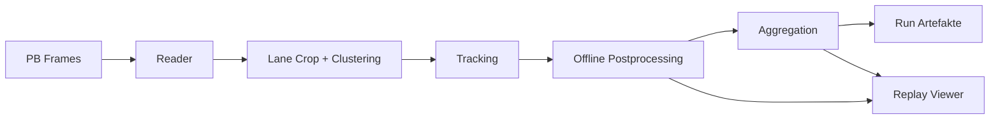
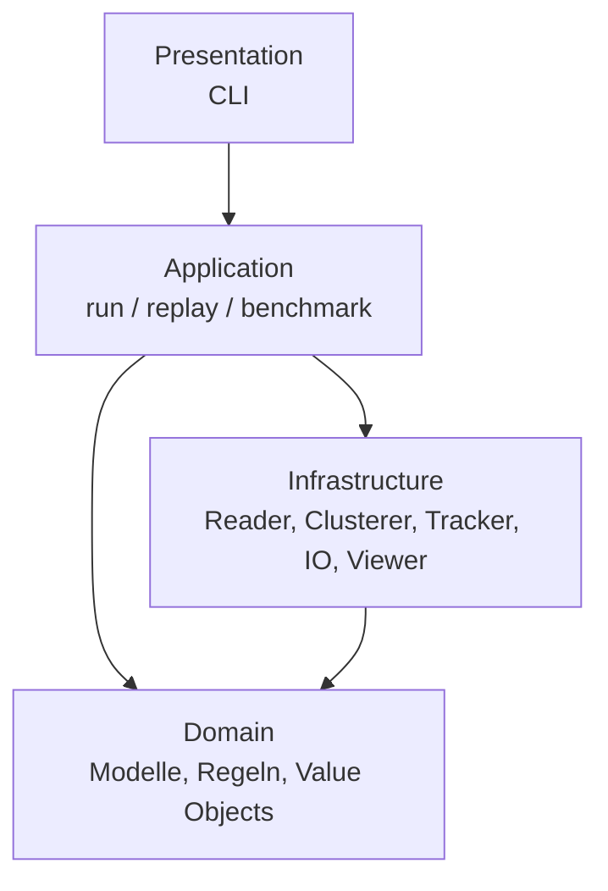
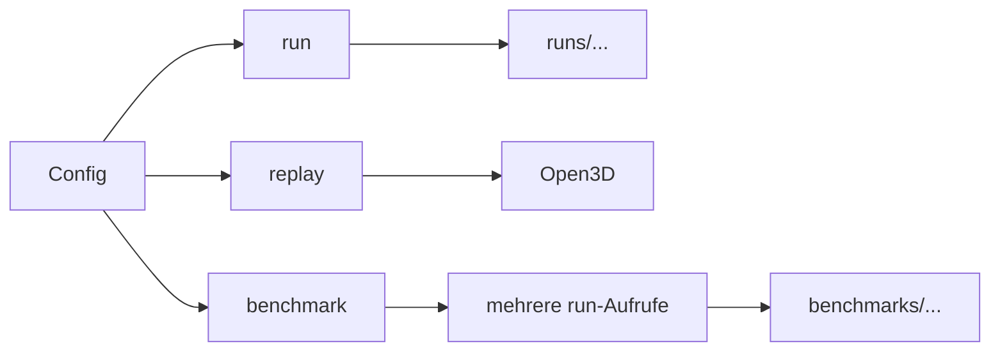

# Tracking Pipeline

Modulare Offline-Pipeline fuer LiDAR-Tracking, Track-Aggregation und Replay auf Basis von `a42.frame.Frame`-Protobufdaten. Das Repo ist darauf ausgelegt, Clusterer, Tracker, Akkumulatoren und Registrierungsbackends austauschbar zu machen, ohne den zentralen Run-Ablauf umzubauen.

## Was das Repo leistet

- liest length-delimited `.pb`-Sequenzen im Format `a42_pb`
- clustert relevante Punkte innerhalb einer Lane-Region
- trackt Objekte ueber mehrere Frames
- aggregiert Punktwolken pro Track zu speicherbaren Fahrzeugwolken
- exportiert Run-Artefakte, Benchmarks und Performance-Reports
- visualisiert denselben Ablauf im Open3D-Replay

Kurz gesagt: `pb -> clustering -> tracking -> aggregation -> artifacts/replay`.

## Quickstart

### Installation

Python `3.10+` wird benoetigt. Empfohlen ist ein frisches virtuelles Environment:

```bash
./scripts/setup.sh
```

Das Skript bevorzugt `python3.12`, faellt lokal aber auf `python3.10` zurueck und installiert das Projekt in `.venv`.

Manuell geht es auch:

```bash
python3.10 -m venv .venv
source .venv/bin/activate
pip install --upgrade pip setuptools wheel
pip install -e .
```

Mit optionalem Registrierungsbackend:

```bash
pip install -e '.[registration]'
```

Mit Dev- und Benchmark-Extras:

```bash
pip install -e '.[dev,registration,benchmark]'
```

Mit Live-QB2-Input ueber QB2 API + MQTT:

```bash
pip install -e '.[live]'
```

Klassifikation ist standardmaessig deaktiviert. Wenn du sie aktivieren willst, brauchst du zusaetzlich ein passendes PointNeXt-Checkout, einen Checkpoint und eine installierte PyTorch-Version.

PointNeXt kann in dieselbe `.venv` integriert werden:

```bash
./scripts/setup_pointnext.sh
```

Das Skript initialisiert das `openpoints`-Submodul und installiert eine CPU-taugliche PointNeXt-Inferenzumgebung in die bestehende `.venv`. Fuer echte Klassifikation brauchst du danach weiterhin einen passenden Checkpoint unter `ckpt/`.

### Pipeline ausfuehren

```bash
tracking-pipeline run -c configs/kalman_voxel.yaml
```

Fuer Live-QB2-Frames mit MQTT-GT:

```bash
tracking-pipeline run -c configs/qb2_live_example.yaml
```

Der Live-Run bleibt offen, bis du ihn mit `Ctrl+C` oder `SIGTERM` beendest. Dann finalisiert die Pipeline den aktuellen Stand und schreibt die normalen Run-Artefakte einmal am Ende weg. Wenn `visualization.live_web_enabled: true` gesetzt ist, startet derselbe Prozess zusaetzlich einen headless Browser-Viewer fuer die rohe Live-Punktwolke. Bei `output.statistics_enabled: true` zeigt die CLI-Statuszeile ausserdem direkt die aktuelle Bearbeitungsfrequenz `hz=recent/total`, den MQTT-Pending-Stand `q=labels/snapshots` und die Reader-Drops `drop=overflow/stale`.

Der genaue Ablauf der Live-Config ist auf einer eigenen Seite beschrieben:
[docs/qb2-live-example-flow.md](docs/qb2-live-example-flow.md).

### Replay starten

```bash
tracking-pipeline replay -c configs/kalman_small_gicp.yaml
```

### Live-Viewer fuer laufenden Dataset-Run

```bash
tracking-pipeline live-view -c configs/qb2_live_example.yaml
```

Optional kannst du dich mit `--run-id <run_id>` an einen bestimmten laufenden oder zuletzt geschriebenen Dataset-Run haengen. Der Live-Viewer ist ein separater, read-only Open3D-Prozess fuer bereits geschriebene Snapshot-Stats unter `dataset/_stats/...`; v1 unterstuetzt bewusst nur `output.mode: dataset` und zeigt einen leichteren Live-Zustand statt vollem Replay.

### Browser-Live-Viewer fuer headless Server

```yaml
visualization:
  live_web_enabled: true
  live_web_host: 0.0.0.0
  live_web_port: 8765
  live_web_history_sec: 0.8
  max_points: 40000
```

Danach ist der Viewer waehrend des laufenden `tracking-pipeline run -c ...` unter `http://<server>:8765` erreichbar. Er streamt pro verarbeitetem `qb2_live`-Frame die rohe Punktwolke direkt aus dem Prozess in den Browser, haelt clientseitig einen Rolling Buffer der letzten `0.8s` und blendet optional Lane-Box, Exit-Linie, Tracker-Debug und Outcome-Beacons ein.

### Snapshot-Fallback fuer bereits geschriebene Dataset-Stats

```bash
tracking-pipeline live-web -c configs/qb2_live_example.yaml --host 0.0.0.0 --port 8765
```

Dieser separate Befehl bleibt als read-only Fallback fuer bereits geschriebene `dataset/_stats/...`-Snapshots erhalten. Er liest dieselben Snapshot-Dateien wie `live-view`, laeuft aber komplett headless als HTTP-Server.

### Benchmark starten

```bash
tracking-pipeline benchmark -c configs/benchmark_curated_real.yaml
```

## Systemfluss


```mermaid
flowchart LR
    A[PB Frames] --> B[Reader]
    B --> C[Lane Crop + Clustering]
    C --> D[Tracking]
    D --> E[Offline Postprocessing]
    E --> F[Aggregation]
    F --> G[Run Artefakte]
    E --> H[Replay Viewer]
    F --> H
```

## Architektur


```mermaid
flowchart TD
    CLI[Presentation<br/>CLI] --> APP[Application<br/>run / replay / benchmark]
    APP --> INF[Infrastructure<br/>Reader, Clusterer, Tracker, IO, Viewer]
    APP --> DOM[Domain<br/>Modelle, Regeln, Value Objects]
    INF --> DOM
```

Die Schichten sind bewusst getrennt:

- `presentation`: CLI und Einstiegspunkte
- `application`: Orchestrierung, Factories, Ports
- `domain`: Modelle und Fachregeln ohne IO-Abhaengigkeiten
- `infrastructure`: konkrete Algorithmen, Reader, Writer, Viewer

## Modus-Ueberblick


```mermaid
flowchart LR
    CFG[Config] --> RUN[run]
    CFG --> REPLAY[replay]
    CFG --> BENCH[benchmark]
    RUN --> RUNOUT[runs/...]
    REPLAY --> VIEW[Open3D]
    BENCH --> SUB[mehrere run-Aufrufe]
    SUB --> BOUT[benchmarks/...]
```

## Komponenten im Ueberblick

### Input

| Typ | Status | Zweck |
| --- | --- | --- |
| `a42_pb` | implementiert | Reader fuer length-delimited `Frame`-Messages aus `.pb`-Dateien |
| `qb2_live` | implementiert | Live-Reader fuer QB2-Rohframes ueber `QB2PointCloudService.stream()` plus GT/Object-Labels ueber MQTT |

### Clusterer

| Algorithmus | Kurzprofil |
| --- | --- |
| `dbscan` | Standard-XYZ-Clusterung auf Lane-Punkten |
| `euclidean_clustering` | einfache Baseline ohne DBSCAN-Charakteristik |
| `ground_removed_dbscan` | Bodenentfernung per RANSAC, danach DBSCAN |
| `hdbscan` | optionale Benchmark-Variante fuer variable Dichten |
| `range_image_connected_components` | Sensorraum-Clusterung auf dem Range-Image |
| `range_image_depth_jump` | Sensorraum-Clusterung mit Tiefensprung-Trennung |
| `beam_neighbor_region_growing` | Region Growing entlang benachbarter Beams |

### Tracker

| Algorithmus | Kurzprofil |
| --- | --- |
| `euclidean_nn` | einfacher Nearest-Neighbor-Tracker |
| `kalman_nn` | Kalman-Filter mit greedy Zuordnung |
| `hungarian_kalman` | Kalman-Filter mit globalem Hungarian-Matching |

### Akkumulatoren

| Algorithmus | Kurzprofil |
| --- | --- |
| `voxel_fusion` | Voxel-Fusion mit Frame-Selektion und Post-Filter |
| `registration_voxel_fusion` | Voxel-Fusion mit Registrierungsstufe vor der Fusion |
| `weighted_voxel_fusion` | Fusion mit per-Chunk-Gewichten |
| `occupancy_consensus_fusion` | behaelt nur konsistente Voxel ueber mehrere Beobachtungen |

### Registrierungsbackends

| Backend | Kurzprofil |
| --- | --- |
| `small_gicp` | optionales Extra fuer GICP-Alignment |
| `icp_point_to_plane` | stabile Open3D-Referenz |
| `generalized_icp` | Open3D-GICP fuer direkten Vergleich |
| `feature_global_then_local` | globales FPFH/RANSAC-Alignment plus lokales ICP |

### Offline-Postprocessing

| Schritt | Kurzprofil |
| --- | --- |
| `tracklet_stitching` | verbindet kompatible Track-Segmente |
| `co_moving_track_merge` | merged parallel laufende Teiltracks |
| `trajectory_smoothing` | glaettet Track-Zentren |
| `track_quality_scoring` | berechnet normierte Track-Qualitaet |

## Wichtige Besonderheiten

- **Reflectivity-Ausgabe**: Im aktuellen Datensatz wird `pointcloud.reflectivity` als Signalquelle gelesen und beim Einlesen zu range-korrigierter Reflectivity `signal * r^2` umgerechnet; Export und Replay nutzen diese Werte.
- **Motion Deskew**: Aggregate koennen optional objektrelativ per Punktzeit (`timestamp_offset`) entzerrt werden.
- **Symmetry Completion**: Aggregate koennen optional lokal vervollstaendigt werden.
- **Fahrzeugdimensionen**: `aggregation_metrics` enthalten `vehicle_length`, `vehicle_width`, `vehicle_height` plus Achseninfo.
- **Performance-Analyse**: Benchmarks schreiben neben Qualitaetsmetriken auch Stage- und Ressourcenmetriken.

## Outputs auf einen Blick

Ein einzelner `run` erzeugt typischerweise:

- `config.snapshot.yaml`
- `summary.json`
- `tracks.jsonl`
- `aggregates/track_<id>.pcd`
- `aggregates/track_<id>.json`
- optional `object_list/`

Ein `benchmark` erzeugt zusaetzlich:

- `results.csv`
- `results.json`
- `leaderboard.md`
- `leaderboard_long_vehicle.md`
- `performance_runs.jsonl`
- `performance_leaderboard.md`
- `performance_components.md`
- `runs/...` mit allen Einzelruns

Details dazu stehen in [docs/artifacts-and-benchmarking.md](docs/artifacts-and-benchmarking.md).

## Konfiguration

Die YAML-Konfiguration ist in feste Sektionen aufgeteilt:

- `input`
- `preprocessing`
- `clustering`
- `tracking`
- `aggregation`
- `postprocessing`
- `output`
- `runtime`
- `visualization`

Wichtig fuer den Alltag:

- Ein Preset wird automatisch mit `base.yaml` im selben Verzeichnis deep-merged.
- Relative `input.paths` werden relativ zur Config-Datei aufgeloest.
- `input.paths` akzeptiert Dateien und Ordner. Ordner werden nicht rekursiv durchsucht; alle direkten `.pb`-Dateien werden nach Dateiname als eine Sequenz genommen.
- Fuer `input.format: qb2_live` duerfen `input.paths: []` gesetzt werden; die Pipeline synthesisiert dann automatisch einen stabilen Quellnamen `qb2_live://<sensor>@<ip>`.
- `benchmark`-Manifeste loesen `sequences` und `presets` ebenfalls relativ zur Manifestdatei auf.
- `benchmark.sequences` akzeptiert ebenfalls Dateien und Ordner mit derselben Ordnersemantik pro Sequence-Eintrag.
- `postprocessing.enable_articulated_vehicle_merge` merged Zugfahrzeug und Anhaenger nur im finalen Output; die normalen Replay-Tracks bleiben unveraendert.
- `visualization.show_articulated_merge_debug: true` blendet im Replay ein Debug-Overlay fuer Trailer-Merge-Paare ein; zur Laufzeit per `M` umschaltbar.
- `qb2_live` wird in v1 nur von `run` unterstuetzt; `replay` und `benchmark` bleiben bewusst dateibasiert.
- `live-view` haengt sich separat an bestehende Snapshot-Stats eines laufenden oder kuerzlich geschriebenen `dataset`-Runs; der Service selbst bleibt headless.
- `runtime.cpu_cores` begrenzt auf Linux die Pipeline per CPU-Affinity plus numerische Thread-Limits auf die angegebene Kernzahl; `0` bedeutet keine explizite Begrenzung.
- `output.mode` waehlt exklusiv zwischen klassischem Run-Ordner (`run`) und globalem Dataset-Baum (`dataset`); es wird nie beides gleichzeitig geschrieben.
- Im `dataset`-Modus liegen die Tagesstatistiken unter `dataset/_stats/YYYY-MM-DD/<run_id>/`, sofern `output.statistics_enabled: true` gesetzt ist.
- Bei `qb2_live` werden `live_status.json`, `object_list/`, `tracks.jsonl`, `summary.json`, `gt_matching/` und `aggregates/` bereits waehrend des laufenden Runs als Zwischenstand aktualisiert. Mit `output.statistics_enabled: false` entfallen `_stats`, Summary, Tracks und Debug-Stats; Aggregate und GT-Matching bleiben aktiv.

Die vollstaendige Referenz steht in [docs/config-reference.md](docs/config-reference.md).

## Presets und typische Startpunkte

| Preset | Typischer Einsatz |
| --- | --- |
| `configs/kalman_voxel.yaml` | schneller Standardlauf ohne Registrierung |
| `configs/kalman_small_gicp.yaml` | Kalman + Registrierungsfusion mit `small_gicp` |
| `configs/kalman_generalized_icp.yaml` | Kalman + Registrierungsfusion mit Open3D-GICP |
| `configs/kalman_feature_global_then_local.yaml` | schwierigere Initiallagen mit globalem Vorab-Alignment |
| `configs/hungarian_weighted.yaml` | globales Matching plus gewichtete Fusion |
| `configs/benchmark_curated_real.yaml` | Vergleich mehrerer Presets auf kuratierter Sequenzmenge |
| [`configs/qb2_live_example.yaml`](configs/qb2_live_example.yaml) | Live-QB2-Frames plus MQTT-Objektlisten fuer `run`; Ablauf siehe [QB2 Live Example](docs/qb2-live-example-flow.md) |

## Weiterfuehrende Docs

- [Config-Referenz](docs/config-reference.md)
- [Artefakte und Benchmarking](docs/artifacts-and-benchmarking.md)
- [QB2 Live Example: Pipeline-Verlauf](docs/qb2-live-example-flow.md)

## Relevante Einstiegspunkte im Code

- [CLI](src/tracking_pipeline/cli.py)
- [Run-Orchestrierung](src/tracking_pipeline/application/run_pipeline.py)
- [Benchmark-Runner](src/tracking_pipeline/application/benchmark_run.py)
- [Config-Modelle](src/tracking_pipeline/config/models.py)
- [Voxel-Fusion-Akkumulator](src/tracking_pipeline/infrastructure/aggregation/voxel_fusion.py)

## Bekannte Grenzen

- `qb2_live` ist in v1 auf genau einen QB2-Sensor pro Run ausgelegt.
- Live-Input wird nur von `run` unterstuetzt; `replay` und `benchmark` erwarten weiterhin endliche dateibasierte Sequenzen.
- Der Replay-Viewer ist lokal und Open3D-basiert, nicht browserbasiert.
- Einige Clusterer oder Backends sind an optionale Extras gebunden.
- Benchmarking nutzt Proxy-Metriken; Qualitaetsranking ist nicht automatisch Ground-Truth-Evaluation.

## Projektstruktur

```text
tracking-pipeline/
├── configs/
├── docs/
├── src/tracking_pipeline/
├── tests/
├── runs/
└── benchmarks/
```

Wenn du direkt in die Details willst:

- Konfigurationsoptionen: [docs/config-reference.md](docs/config-reference.md)
- Run- und Benchmark-Artefakte: [docs/artifacts-and-benchmarking.md](docs/artifacts-and-benchmarking.md)
